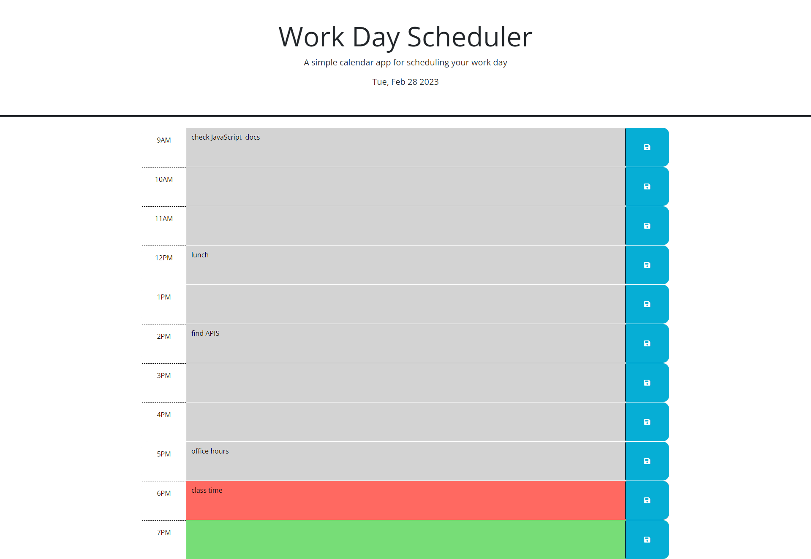

# 05 work-day-planner


## My Task

This week's Challenge was to modify starter code to create an application that allows a user to save tasks for each hour of the day. This app will run in the browser and will feature dynamically updated HTML and CSS powered by JQuery. It will have a clean and polished, responsive user interface that adapts to multiple screen sizes.

## Table of contents

- [User Story](#userstory)
- [Acceptance Criteria](#AcceptanceCriteria)
- [Preview](#preview)
- [Contributing](#contributing)
- [License](#license)


## User Story

```
AS AN employee with a busy schedule
I WANT to add important events to a daily planner
SO THAT I can manage my time effectively

```

## Acceptance Criteria

```
GIVEN I am using a daily planner to create a schedule
WHEN I open the planner
THEN the current day is displayed at the top of the calendar
WHEN I scroll down
THEN I am presented with timeblocks for standard business hours
WHEN I view the timeblocks for that day
THEN each timeblock is color coded to indicate whether it is in the past, present, or future
WHEN I click into a timeblock
THEN I can enter an event
WHEN I click the save button for that timeblock
THEN the text for that event is saved in local storage
WHEN I refresh the page
THEN the saved events persist


```


## Preview

[Deployed Link]('https://janiece-lewis.github.io/work-day-planner/')

## Contributing
Pull requests are welcome. For major changes, please open and issue first to discuss what you would like to change.


## License
[MIT](https://choosealicense.com/licenses/mit/)
